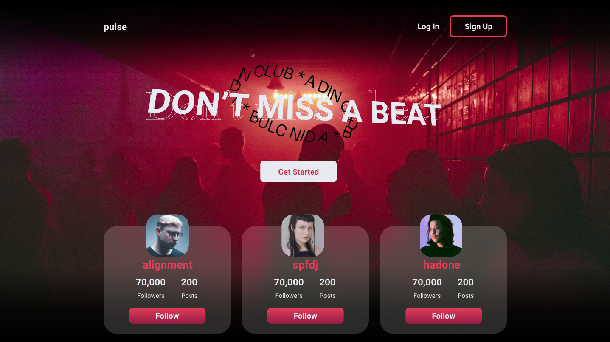
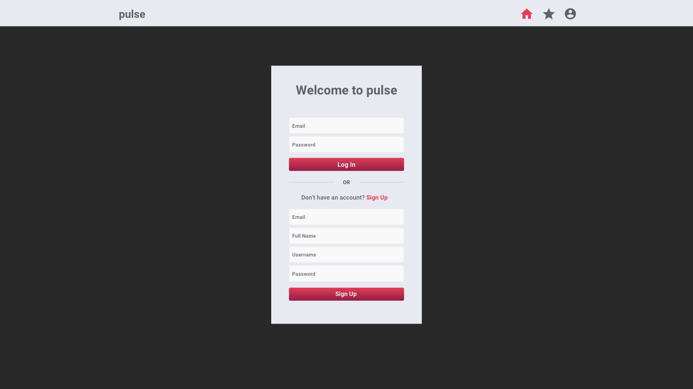
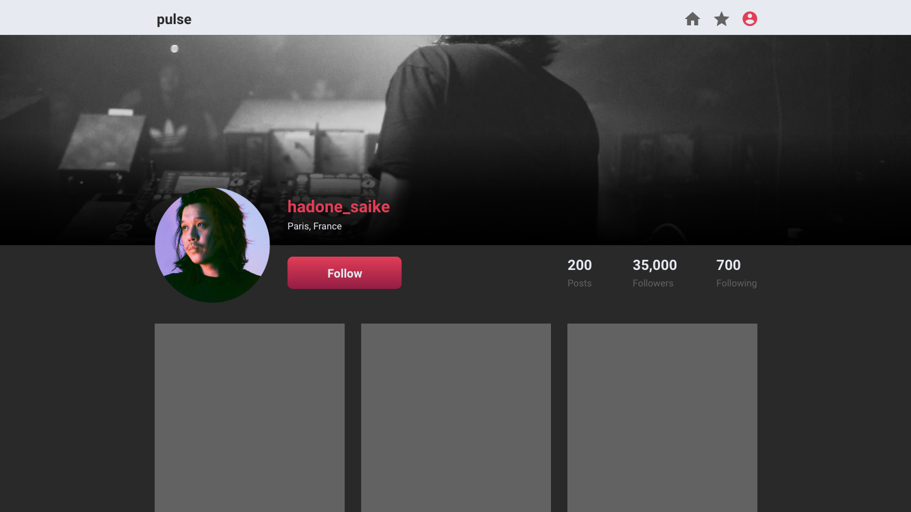
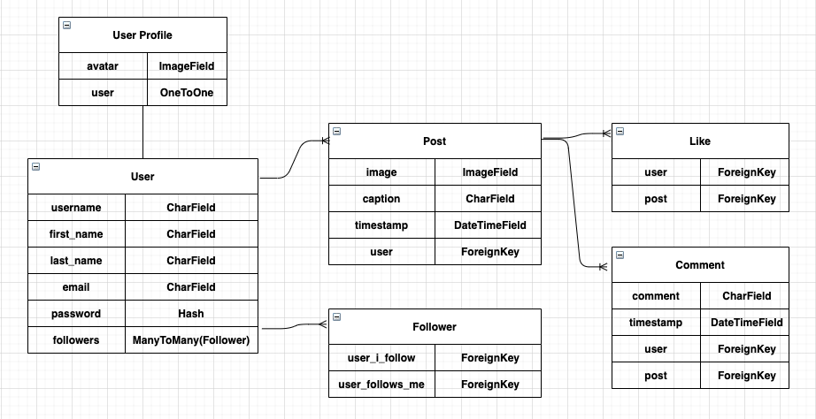

# pulse
pulse is a social media platform for dance music artists and enthusiasts.

[Demo](https://pulse-react.herokuapp.com/)
 
[Backend](https://pulse-django.herokuapp.com/)

## About the Project

 
* Users can create a profile and log in. 
* On their profile they can see their profile with their posts.
* Users can edit or delete their profile.
* Users are only authorized to delete their posts or profile.
* On the home page, users can see posts from other users.
* Users can comment on posts.
* Users can visit other users profiles.
* The follow functionality is coming soon.
* When you add a post you can include links to other sites, which will then show up under each post.

## Built With
* Django
    * Django REST Framework
    * SimpleJWT
* React
    * Axios
    * Recoil
* PostgreSQL
* Bootstrap

## Screenshots

## ERD
